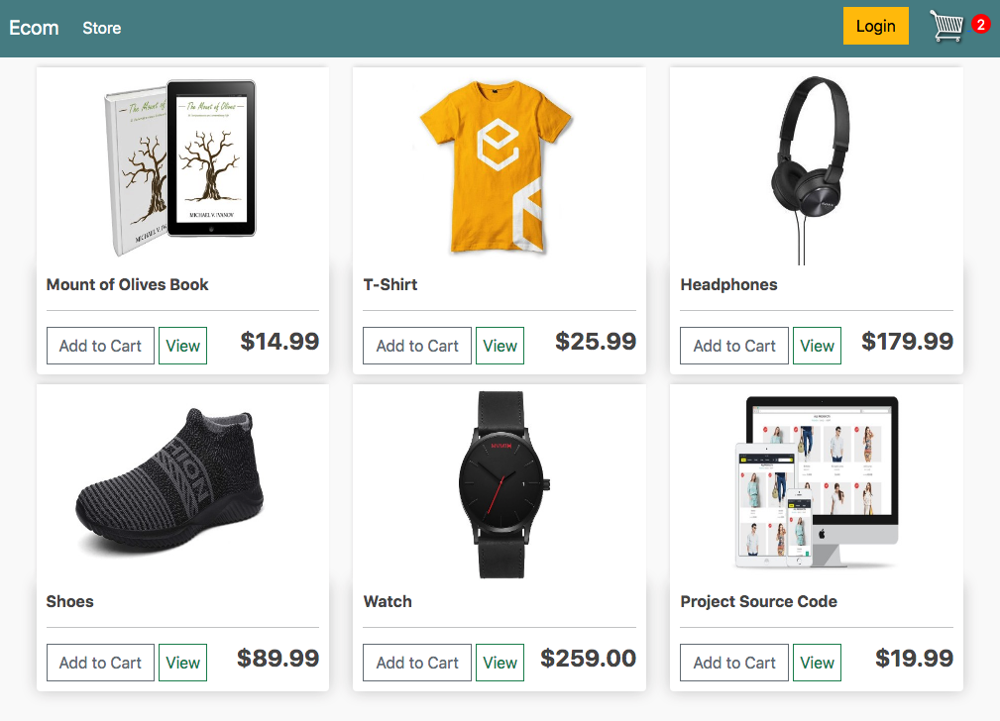
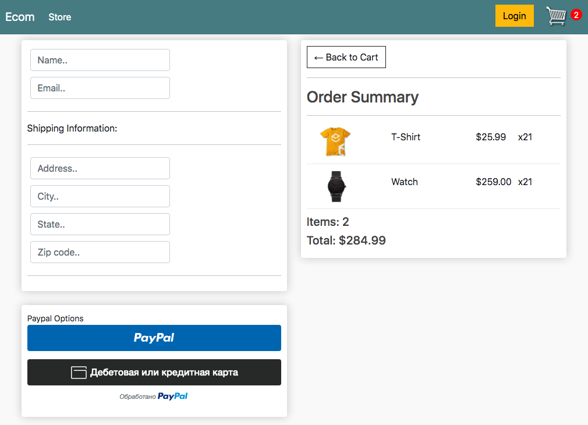

<h1>Ecommerce Website (Tutorial course 'Dennis Ivy')</h1>

</a>
</a>

# Requirements
* Python 3.6+
* Django 3+

# Installation

1. Clone repository.
   
2. Create virtual environment and activate it.
    `python3 -m venv name_of_env`

3. Install requirements from the file.

   `pip3 install -r requirements.txt`

4. Create models.

5. Make migrations.

6. Run the server. 

     `python3 manage.py runserver`

